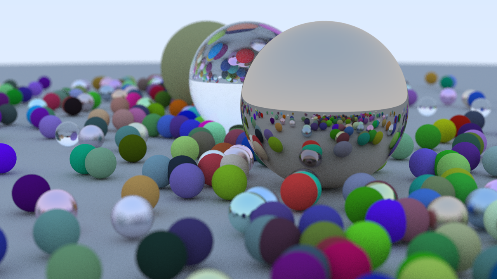

# Ray Tracer

Decided to learn how to do a ray tracer.

I followed the Ray Tracing In One Weekend (see https://raytracing.github.io/books/RayTracingInOneWeekend.html) course, and will follow the next two ones (see https://raytracing.github.io/).

At this time, the code is pretty similar, but it will improve in the coming weeks.

It can rendered spheres with some materials (metal, lambertian, dielectric). Has a simple antialiasing (used multiple samples), background gradient, defocus blur.

Pretty cool to gain some intuition about 3D math, refresh my knowledge of linear algebra, and demystify computer graphics. Thanks to Google Images for the schemas, and ChatGPT for some explanations (but it's not as powerful as I thought for this kind of subject, unfortunately).

To execute it: `cmake -B build && cmake --build build && ./build/RTX > img.ppm`
This will build the code, run it, and save the rendered image as a PPM.
You need CMake (>=3.10) to run it. Any version of C++ should be fine with it (C++17 used here).

(In fact, this sounds more like a path tracer.)